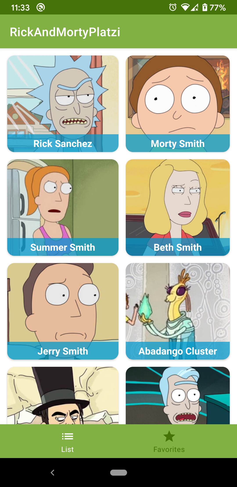
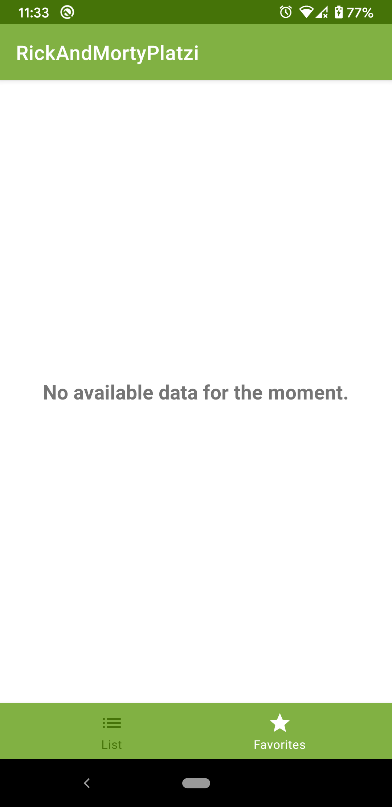
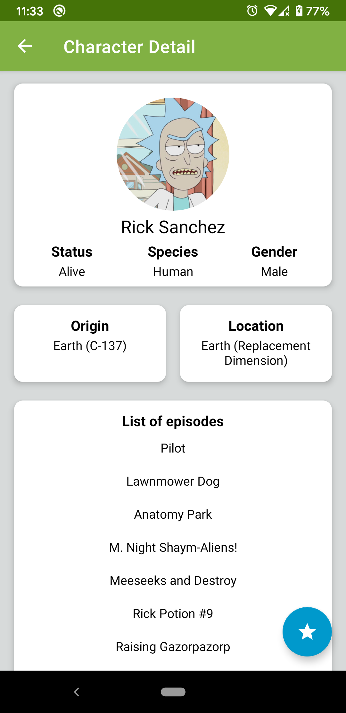
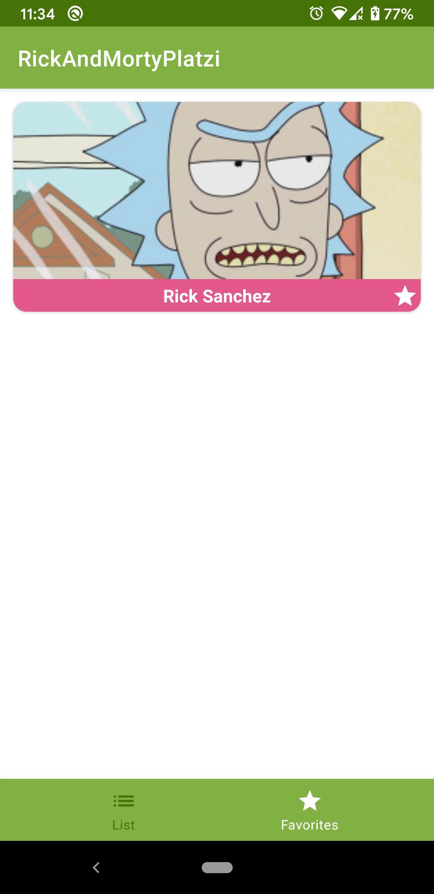

# Rick and Morty (Clean Architecture Platzi App)

Éste es el proyecto para el curso de Clean Architecture en Android. Con esta aplicación los usuarios pueden ver todos los personajes de la serie de televisión Rick y Morty. 

## Experiencia de usuario

Este proyecto contiene las siguientes características.

* Una pantalla de inicio con un menú al pie de la pantalla con las siguientes opciones:
    * Un listado de personajes que aparecen en la serie.
    * Un listado de tus personajes favoritos.
* Una pantalla de detalle del personaje que muestra información adicional (estatus, especie, género, origen, ubicación y listado de episodios donde ha aparecido el personaje).
* Una opción para salvar tu personaje favorito.

## Capturas de pantalla

  
  

  
  

## Guía de implementación

### Trabajando con la API de Rick y Morty

Este proyecto implementa el API del show de televisión Rick y Morty. Para conocer más sobre su uso visita su página: https://rickandmortyapi.com/documentation/

### Arquitectura

Este proyecto sigue buenas prácticas de la arquitectura limpia (Clean Architecture) planteada por Robert C. Martin para hacer un código más independiente, mantenible y sencillo para generar pruebas unitarias.

#### Capas

* App: UI.
* Presentación: View Models.
* Casos de uso: GetAllCharactersUseCase, GetEpisodeFromCharacterUseCase, etc.
* Dominio: Character, Episode, Location, etc.
* Datos: CharacterRepository, LocalCharacterDataSource, etc.
* Framework: ImageManager, DatabaseManager, RequestManager.

Este proyecto usa ViewModel para almacenar y manejar datos, así como comunicar cambios hacia la vista.

Este proyecto usa LiveData para manejar la navegación y los valores en la aplicación.

### Persistencia de datos - Room

Este proyecto utiliza Room para salvar los personajes favoritos del usuario.

### Administrador de solicitudes: Retrofit

Este proyecto utiliza Retrofit para proporcionar una lista de personajes y su información desde una API.

### Biblioteca de imágenes - Glide

Este proyecto utiliza Glide para cargar las imágenes de los personajes. Para el uso de placeholders se manejan íconos proporcionados por la página de Material Design (https://material.io/resources/icons/).

### Inyección de dependencia - Dagger

Este proyecto utiliza Dagger para gestionar la inyección de dependencia.

## Copyright

The open source API of Rick and Morty used in this project is provided by the following site: https://rickandmortyapi.com/
